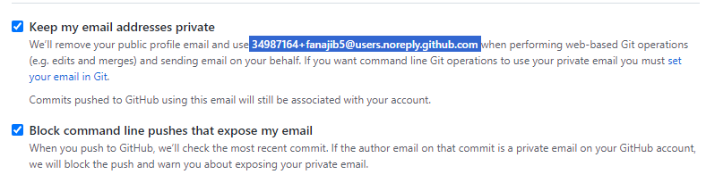
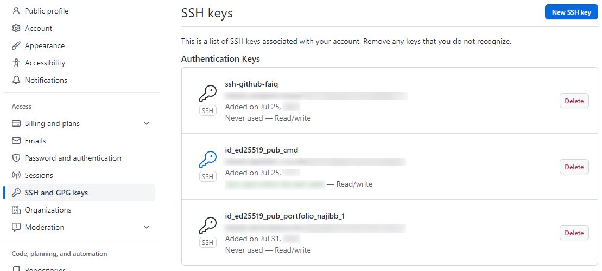

Catatan yang berisi bagaimana cara instalasi, konfigurasi dan contohnya dari Git dan Github.
<!--more-->
---

## Perkenalan

[Git](https://git-scm.com/) adalah sistem kontrol versi terdistribusi yang bersifat _open source_ dan gratis yang dirancang untuk menangani segala sesuatu mulai dari proyek kecil hingga sangat besar dengan ceoat dan efisien.

Sedangkan, [GitHub](https://github.com/about) [adalah](https://en.wikipedia.org/wiki/GitHub) platform dan layanan _developer_ yang lengkap untuk membangun, menskalakan, dan mengirimkan perangkat lunak yang aman menggunakan Git.

## Instalasi Git

Instalasi Git untuk Windows yaitu,

<details>
<summary><strong>Windows</strong></summary>

_Download installer_ Git terlebih dahulu pada [https://git-scm.com/downloads](https://git-scm.com/downloads). Kemudian buka installer tersebut.

Ikuti langkah [selanjutnya](https://www.nesabamedia.com/cara-install-git-di-windows-10/). Tinggal klik _Next_, pastikan _default_ aja, lalu _next_ lagi. Seperti biasa~~

</details>
<br/>
<details>
<summary><strong>Linux (Ubuntu)</strong></summary>

Lakukan _update_ dan _upgrade_ pada sistem dengan perintah berikut:

```bash
sudo apt update && sudo apt upgrade -y
```

Install _package_ Git:

```bash
sudo add-apt-repository ppa:git-core/ppa
sudo apt update
sudo apt install Git
```

Verifikasi versi Git dan pastikan bahwa **minimal** versi 2.28[^1]

```bash
git --version
```

</details>
<br/>
<details>
<summary><strong>MacOS</strong></summary>

Ikuti langkah [ini](https://www.theodinproject.com/lessons/foundations-setting-up-git#step-1-install-git) hehehe

</details>

## Konfigurasikan Git dan GitHub

### Buat akun GitHub

Buka [GitHub.com](https://github.com/signup) dan buat akun! Selama pengaturan akun nanti, alamat email akan diminta oleh Git. Dan harus berupa email asli. Karena kontribusi akan diidentifikasi secara _default_ oleh email yang akan digunakan.

Kekuatiran akan privasi, atau hanya tidak ingin alamat email diketahui publik, maka dapat dicentang dua kotak berikut di halaman Pengaturan Email setelah masuk ke [pengaturan akun GitHub](https://github.com/settings/emails):



Jadi, email seperti ```34987164+fanajib5@users.noreply.github.com``` akan digunakan untuk konfigurasi Git.

### Siapkan Git

Agar Git berfungsi dengan baik, pengguna harus memberi tahu sehingga pengguna Git lokal dapat ditautkan ke GitHub. Saat bekerja dalam tim, orang lain mungkin melihat apa yang telah dilakukan dan siapa yang melakukan pada setiap baris kode.

Pada Windows, aplikasi bawaan ```Git Bash.exe``` dapat digunakan untuk konfigurasi Git.

Perintah di bawah ini akan melakukan konfigurasi Git. Informasai yang ada di dalam tanda kutip dapat diganti dengan informasi pribadi **(tetapi sertakan tanda kutip)!**

```bash
git config --global user.name "BudiTanpoHutang99"
git config --global user.email "hutangtanpo@budi.id"
```

Kalau email privat GitHub yang dipilih, berarti konfigurasinya:

```bash
git config --global user.email "071367+BudiTanpoHutang99@users.noreply.github.com"
```

Cabang _default_ pada repositori baru diubah oleh GitHub dari ```master``` ke ```main```. Jadi, ubah cabang default untuk Git menggunakan perintah:

```bash
git config --global init.defaultBranch main
```

Luaran warna-warni dengan git dapat diaktifkan dengan:

```bash
git config --global color.ui auto
```

Perilaku rekonsiliasi _default branch_ ke _merging_ dapat disetel dengan:

```bash
git config --global pull.rebase false
```

OK! Mari coba verifikasi hasil dari konfigurasi Git yang sudah dilakukan:

```bash
git config --get user.name
git config --get user.email
```

### Buat kunci SSH

Kunci SSH adalah pengenal yang aman secara kriptografis yang mana seperti kata sandi yang sangat panjang untuk mengidentifikasi mesin pengguna. GitHub menggunakan kunci SSH sehingga pengguna tanpa harus mengetik _username_ dan _password_ setiap saat.

Pada Windows, dapat digunkan [PuTTYgen.exe](https://www.ssh.com/academy/ssh/putty/windows/puttygen) atau [OpenSSH](https://askme4tech.com/how-configure-ssh-key-based-authentication-windows) untuk melakukan _generate_ [kunci SSH](https://phoenixnap.com/kb/generate-ssh-key-windows-10). Lalu [simpan](https://docs.digitalocean.com/products/droplets/how-to/add-ssh-keys/create-with-putty/) kedua _public key_ dan _private key_ tersebut.

### Tautkan kunci SSH dengan GitHub

Pertama, masuk ke GitHub dan klik gambar profil di pojok kanan atas. Kemudian, klik _Settings_ di menu _drop-down_.

Selanjutnya, di sisi kiri, klik ```SSH dan GPG Keys```. Kemudian, klik tombol ```New SSH key``` di pojok kanan atas. Beri nama kunci SSH tersebut sesuatu yang cukup deskriptif atau nama apa pun itu. Biarkan jendela Pengaturan GitHub terbuka untuk melakukan langkah selanjutnya.

Sekarang, salin **kunci SSH publik** yang tadi sudah disimpan (Perhatikan bahwa **ekstensi file .pub** penting dalam kasus ini.)

Sekarang, kembali ke GitHub di jendela browser tadi dan _paste_ kunci yang disalin ke _key field_. [Pertahankan jenis kunci](https://nishtahir.com/how-to-enable-ssh-key-verification-with-git-and-github/#adding-your-key-to-github) sebagai ```Authentication Key```, lalu klik ```Add SSH key```. Sudah selesai! Kunci SSH telah berhasil ditambahkan!



### Menguji kunci SSH

Ikuti petunjuk dalam [artikel dari GitHub ini](https://help.github.com/en/articles/testing-your-ssh-connection) untuk memverifikasi koneksi SSH (**Jangan lupa menghilangkan** ```$``` **kode disalin!**). Respon ini dapat dilihat di terminal Anda: **Hi username! You’ve successfully authenticated, but GitHub does not provide shell access**. Jika pesan ini muncul, kunci SSH berhasil ditambahkan. Jika luaran tidak sesuai, coba lakukan langkah-langkah ini lagi atau [buka referensi ini](https://www.theodinproject.com/lessons/foundations-setting-up-git#step-25-testing-your-key).

## Pelajaran yang Dapat Diambil

Instalasi Git pada setiap OS cukup berbeda, terutama Windows yang tidak dibekali dengan _Package Manager_. Berbeda dengan Ubuntu yang ada ```apt``` dan MacOS dengan ```brew```.

Terdapat artikel yang membahas ada algoritma _asymmetric cryptography_ yang yang tidak disarankan lagi untuk _generate_ SSH, karena sudah dianggap lemah. Namun sepertinya saya lupa tidak menyimpan _link_ artikel tersebut hehehe. Oh! Barusan ketemu artikel yang mirip, [ternyata kunci DSA](https://thechief.io/c/news/github-is-making-protocol-security-changes-for-ssh-users/).

Terima kasih bagi yang sudah tersasar ke _section_ catatan ini dan membacanya. Semoga catatan ini bermanfaat bagi Anda.

Sekian. Salam.

[^1]: [Setting Up Git](https://www.theodinproject.com/lessons/foundations-setting-up-git) oleh The Odin Project.
