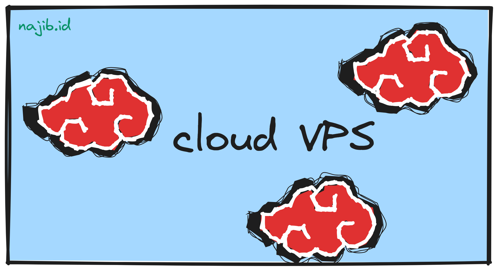
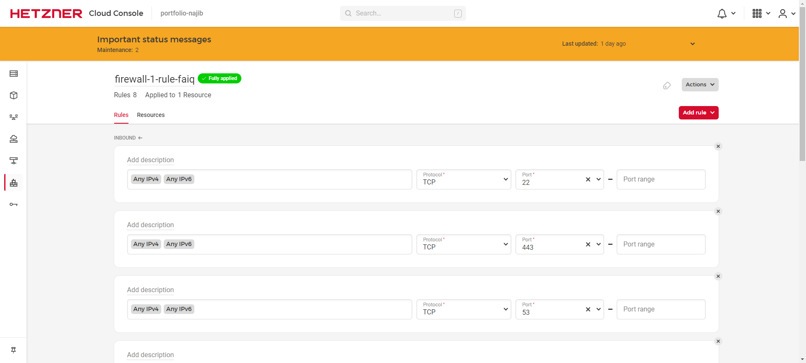

_Nganu_, jadi maksudnya adalah beberapa tahun lalu saya pernah iseng _wal_ coba membeli layanan [VPS](https://www.hostinger.co.id/tutorial/apa-itu-vps) dari [DigitalOcean](https://www.digitalocean.com/)[^1]. Alasannya ya... nggak ada. Namanya juga iseng, kenapa harus ada alasan hehe~

Singkat cerita, VPS dari DO atau DigitalOcean itu belum sampai sebulan dan sudah saya akhiri. Setelah beberapa purnama dan tersasar ke sana-sini[^2], akhirnya pilihan jatuh kepada [Hetzner](https://www.hetzner.com/)[^1]. Sebuah penyedia _cloud server_ yang kata orang-orang cukup sulit untuk melakukan pendaftara. Nyatanya ya, memang! Hahaha.

Singkat cerita, saat itu saya belum tahu apa-apa pun penasaran mengikuti [tutorial ini](https://dev.to/styxlab/ghost-cms-on-hetzner-cloud-1dji). Bermula dari istilah [Jamstack](https://jamstack.org/) yang baru saya ketahui dengan sangat prematur membawa saya ke pertanyaan,

> Bagaimana kalau _static site_ bisa direkayasa agar tetap mengonsumsi data yang dinamis? <cite>penulis yang belajar ilmu _web_ secara cabutan[^3]</cite>

Tanpa _fa-fi-fu was-wes-wos_, saya langsung daftar akun dan ~~membeli~~ menyewa VPS _(yang termurah dong)_ milik Hetzner. Saya pun mengikuti tutorial itu tadi dengan rajin. Satu demi satu segala halangan _rintangan membentang, tak jadi masalah dan tak kan jadi beban pikiran_&mdash;saya _googling_ mencari solusinya semaksimal mungkin.

Hari-hari pun terbagi dengan urusan kerjaan, urusan hati&mdash;_ehem_ perut dan urusan server Hetzner tadi. Hingga suatu waktu saya mengikuti bisikan gaib di telinga. Ya, saya _mundung_/_nggondok_/ngambek/merajuk dan tida melanjutkan rasa penasaran tadi hahaha.

VPS Hetzner itu pun akhirnya terbengkalai. Hingga sebuah _email_ aneh masuk. Isinya memberitahukan bahwa alamat tagian (_invoices_) saya sudah berganti. _Ja*cok_. Saya baru tahu rasanya kena retas.



Beruntung tim _support_ sangat tanggap saat saya mengirim email untuk melaporkan insiden itu. Mereka akhirnya membalas: "_As your account got hacked and you had no products (except the ones ordered by the hacker) we have cancelled your account._"

Alhamdulillah debit _online_ saya masih aman. Ternyata berbagai peringatan tentang kombinasi password yang susah ditebak[^4] memang benar adanya, dan sangat bermanfaat.

OK! Jadi intinya, tulisan saya tadi tidak ada intinya dan tidak nyambung secara langsung dengan postingan ini hehe.

## Pilih dan _set up_ VPS

Tahun ini, saya balikan lagi dengan Hetzner hehe. Sebelumnya juga, saya sudah 3x mengulangi untuk mendaftar akun Hetzner baik dengan _email_ yang sama, pun _email_ yang berbeda tetapi semuanya ditolak. Nah, tapi semuanya teratasi setalah komplain terkait akun lama saya _suspended_ karena diretas. Dan, _fualla_ akun saya kembali aktif~~

Alhasil, sebuah VPS berjenis [CAX11](https://www.hetzner.com/cloud#pricing) yang ditenagai [Ampere® Altra® processors](https://amperecomputing.com/products/processors) pun berhasil saya sewa. Harganya, yaa murah kok dibandingkan biaya wifi bulanan.

VPS pun aktif dan saya segera mengatur konfigurasinya lalu melakukan _login_.

Jika pada perangkat Windows, akses VPS dapat melalui aplikasi [PuTTY](https://www.putty.org/). _Download_ dan lakukan seperti biasa, _next, next,_ dan _next_ sampe instalasinya selesai.

### _Login_ pada VPS

Setelah ter-_install_ dengan benar lakukan [langkah](https://www.hostinger.com/tutorials/getting-started-with-vps-hosting#2_Log_Into_Your_VPS_Using_Secure_Shell_SSH) berikut:

1. Buka aplikasi PuTTY.
2. Salin _IP Address_ dari Cloud Console, sesuaikan mau pakai ```IPv4```[^5] atau ```IPv6```[^5]. Kemudian biarkan port tetap ```22```.
3. Tempel _IP Address_ tadi ke kolom pada PuTTY dan klik tombol ```Open```. Lalu akan muncul _terminal/CMD window_.
4. [Masukkan](https://www.digitalocean.com/community/tutorials/how-to-log-into-a-vps-with-putty-windows-users) _username_ dan _password_ dari akun ```root``` VPS. Perhatikan bahwa _password_ yang diketik tidak muncul pada terminal PuTTY.

Selain itu, bisa juga _login_ melalui _terminal/CMD window_ dengan [langkah](https://www.domainesia.com/panduan/cara-remote-vps/#Cara_Remote_Cloud_VPS_via_SSH_melalui_Terminal_Linux) berikut:

1. Buka terminal dan ketik ```ssh username@ip_address_nya```.
2. Tunggu sejenak dan tampilan _terminal_ akan meminta untuk memasukkan _password_ dari _username_ yang akan mengakses VPS tersebut.

Jika menggunakan [Ubuntu](https://ubuntu.com/download), maka lakukan _update_ dan _upgrade_ pada _package_ dari VPS dengan perintah:

```bash
sudo apt update
sudo apt upgrade
```

Jika VPS meminta konfirmasi, maka ketik ```-y``` lalu tunggu hingga selesai. Ikuti jika VPS meminta untuk melakukan _reboot_.

### _Set up firewall_ VPS

Pada Ubuntu, lakukan langkah berikut:

1. Izinkan UFW agar aktif pada VPS,

   ```bash
   sudo ufw enable
   ```

2. Jika VPS mengembalikan respons bahwa _command_ tidak dikenali, maka _install_ dahulu,

   ```bash
   sudo apt-get install ufw
   ```

3. Jika sudah ter-_install_, maka lakukan kembali langkah pertama.
4. Cek status _firewall_,

   ```bash
   sudo ufw status
   ```

5. Tambahkan _rule_ sesuai [apa yang dibutuhkan](https://www.digitalocean.com/community/tutorials/how-to-set-up-a-firewall-with-ufw-on-ubuntu-20-04).

### _Set up_ aplikasi sesuai apa yang dibutuhkan

Karena pada dasarnya VPS ini akan digunakan sebagai tempat _hosting_ proyek agar bisa di-_demo_-kan untuk kepentingan portfolio pribadi, maka akan di-_install_ beberapa aplikasi atau _package_.

Karena tidak ada panduan pasti dan untuk berjaga-jaga, saya _install_ banyak _package_ dan aplikasi hahaha.

#### LEMP _stack_

_Stack_ yang digunakan di dunia per-kodingan, utamanya _website_, seteau saya (tanpa data yak!) adalah LAMP dan LEMP.

[LAMP](https://www.digitalocean.com/community/tutorials/how-to-install-linux-apache-mysql-php-lamp-stack-ubuntu-18-04#introduction) adalah kepanjangan dari Linux, Apache, MySQL, PHP. Sedangkan [LEMP](https://www.digitalocean.com/community/tutorials/how-to-install-linux-nginx-mysql-php-lemp-stack-on-ubuntu-22-04#introduction) adalah kepanjangan dari Linux, Nginx, MySQL, PHP.

Kebetulan,saya `~~**iseng lagi**~~ memilih _stack_ LEMP ini. Oh lupa, ada alasannya _ding_. VPS ini sudah saya rencanakan sebagai subdomain website ini, yaitu [```portfolio.najib.id```](https://portfolio.najib.id) hehehe. _Anyway_, berikut langkah-langkahnya.

##### _Install_ NGINX _web server_

_Update_ VPS terlebih dahulu dan **bisa** ditambahkan ```-y``` untuk langsung konfirmasi _package_ yang akan di-_update_.

```bash
sudo apt update -y
```

Lalu, lanjutkan _install_ [NGINX](https://www.digitalocean.com/community/tutorials/how-to-install-linux-nginx-mysql-php-lemp-stack-on-ubuntu-22-04#step-1-installing-the-nginx-web-server).

```bash
sudo apt install nginx -y
```

Setelah instalasi NGINX selesai dan ```ufw``` sudah diizinkan dari langkah sebelumnya, selanjutnya cek aplikasi yang dapat dimasukkan ke _rule_ ```ufw```.

```bash
sudo ufw app list
```

Luaran yang ditampilkan oleh VPS, **kurang lebih** seperti berikut,

```bash
Output
Available applications:
  Nginx Full
  Nginx HTTP
  Nginx HTTPS
  OpenSSH
```

Izinkan port ```80``` yang secara _default_ sebagai port yang menerima [akses HTTP](https://dewabiz.com/port-yang-digunakan-web-server/).

```bash
sudo ufw allow 'Nginx HTTP'
```

Cek lagi status pada ```ufw```.

```bash
sudo ufw status
```

Luarannya **kurang lebih** akan seperti berikut

```bash {linenos=false,hl_lines=[7,9]}
Output
Status: active

To                         Action      From
--                         ------      ----
OpenSSH                    ALLOW       Anywhere
Nginx HTTP                 ALLOW       Anywhere
OpenSSH (v6)               ALLOW       Anywhere (v6)
Nginx HTTP (v6)            ALLOW       Anywhere (v6)
```

Cek hasil konfigurasi NGINX pada peramban (_browser_) dengan memasukkan ```http://ip_address``` atau ```domain_qoeh.com```. Hasilnya adalah tulisan _Welcome to nginx!_.

##### _Install_ MariaDB RDBMS

Karena masih dalam waktu yang berdekatan, maka bisa langsung _install package_ MariaDB tanpa harus melakukan _update package_ terlebih dahulu.

```bash
sudo apt install mariadb-server
```

Pastikan bahwa MariaDB sudah berjalan.

```bash
sudo systemctl start mariadb.service
```

Kemudian, lakukan konfigurasi pada MariaDB.

```bash
sudo mysql_secure_installation
```

Sesuaikan _prompt_ dengan [apa yang dibutuhkan](https://www.digitalocean.com/community/tutorials/how-to-install-mariadb-on-ubuntu-20-04#step-2-configuring-mariadb).

Selanjutnya, saya memilih opsi untuk menambahkan _user_ selain _root_.

```bash
sudo mariadb
```

Setelah masuk ke _prompt_ ```MariaDB&nbsp;[(none)]>```, buat _user_ baru tersebut dan menyetel _privilege_-nya.

```bash
GRANT ALL ON *.* TO 'budi'@'localhost' IDENTIFIED BY 'BudiTanpoHutang619' WITH GRANT OPTION;
```

Lakukan _flush privileges_ untuk memastikan konfigurasi _user_ baru tersebut.

```bash
FLUSH PRIVILEGES;
```

OK! Keluar dari _prompt_ MariaDB

```bash
exit
```

##### _Install_ PHP

Lakukan [instalasi PHP](https://www.digitalocean.com/community/tutorials/how-to-install-linux-nginx-mysql-php-lemp-stack-on-ubuntu-22-04#step-3-installing-php) dengan versi sesuai apa yang dibutuhkan.

```bash
sudo apt install php8.1-fpm php-mysql
```

##### Konfigurasi NGINX agar menggunakan PHP

Pertama-tama, buat direktori _root web_ dengan domain yang dinginkan, misalnya adalah [```portfolio.najib.id```](https://portfolio.najib.id) sebagai nama _folder_-nya.

```bash
sudo mkdir /var/www/portfolio.najib.id
```

Atur kepemilikan direktori dengan ```$USER```.

```bash
sudo chown -R $USER:$USER /var/www/portfolio.najib.id
```

Lalu, buat konfigurasi NGINX pada direktori ```sites_available``` melalui ```nano```.

```bash
sudo nano /etc/nginx/sites-available/portfolio.najib.id
```

Pada _file_ konfigurasi domain yang baru dibuat tersebut, isi dengan konten seperti berikut.

```bash {linenos=false,hl_lines=["3-23"]}
# located at /etc/nginx/sites-available/portfolio.najib.id

server {
    listen 80;
    server_name portfolio.najib.id www.portfolio.najib.id;
    root /var/www/portfolio.najib.id;

    index index.html index.htm index.php;

    location / {
        try_files $uri $uri/ =404;
    }

    location ~ \.php$ {
        include snippets/fastcgi-php.conf;
        fastcgi_pass unix:/var/run/php/php8.1-fpm.sock;
     }

    location ~ /\.ht {
        deny all;
    }

}
```

Selesai mengubah, keluar dari ```nano``` editor dengan ```CTRL + X``` lalu ```Y``` unguk konfirmasi menyimpan file yang diubah tadi, dan tekan ```ENTER```.

Buat _symbolic link_ dari direktori tadi.

```bash
sudo ln -s /etc/nginx/sites-available/portfolio.najib.id /etc/nginx/sites-enabled/
```

Putuskan sambungan _symbolic link_ konfigurasi _default_.

```bash
sudo unlink /etc/nginx/sites-enabled/default
```

Lalu cek konfigurasi dengan mengetesnya.

```bash
sudo nginx -t
```

Jika berhasil, akan muncul hasil seperti berikut. Jika belum berhasil, berarti ada port ```80``` dari konfigurasi lainnya yang ikut _'ditarik'_ oleh NGINX.

```bash
nginx: the configuration file /etc/nginx/nginx.conf syntax is ok
nginx: configuration file /etc/nginx/nginx.conf test is successful
```

_Restart_ NGINX untuk menerapka perubahan konfigurasi.

```bash
sudo systemctl reload nginx
```

Buat alaman awal dari _website_ saat _IP Address_ atau _domain_ diakses.

```bash
nano /var/www/portfolio.najib.id/index.html
```

Isi file ```index.html``` tersebut contohnya seperti ini

```html
<html>
<!-- /var/www/portfolio.najib.id/index.html -->

  <head>
    <title>portfolio.najib.id website</title>
  </head>

  <body>
    <h1>Hello World!</h1>

    <p>This is the landing page of <strong>portfolio.najib.id</strong>.</p>
  </body>

</html>
```

Cek hasilnya pada peramban (_browser_) dengan memasukkan ```http://ip_address``` atau ```domain_qoeh.com```.

#### PostgreSQL Database

_Install package_ [PostgreSQL](https://www.digitalocean.com/community/tutorials/how-to-install-postgresql-on-ubuntu-22-04-quickstart) dengan perintah berikut.

```bash
sudo apt install postgresql postgresql-contrib
```

Instalasi tersbut akan membuat _user_ dengan nama ```postgres``` dengan _role root_ pada PostgreSQL.

Ketika ingin membuat _user_ atau _role_ yang baru, maka dapat digunakan perintah berikut.

```bash
sudo -u postgres createuser --interactive
```

Dan akan muncul ```prompt``` pada _terminal_ yang dapat diisi sesuai kebutuhan.

```bash {linenos=false,hl_lines=[1]}
Output
Enter name of role to add: sammy
Shall the new role be a superuser? (y/n) y
```

#### MongoDB Database

Pertama-tama, masukkan kunci publik ```GPG``` melalui perintah ```curl```.

```bash
curl -fsSL https://www.mongodb.org/static/pgp/server-4.4.asc | sudo apt-key add -
```

Lanjutkan dengan mendaftarkan _package_ MongoDB pada ```apt```. Di sini saya hanya menggunakan opsi ```arm64``` yang mana menyesuaikan jenis _processor_ yaitu ARM64.

```bash
echo "deb [ arch=arm64 ] https://repo.mongodb.org/apt/ubuntu focal/mongodb-org/4.4 multiverse" | sudo tee /etc/apt/sources.list.d/mongodb-org-4.4.list
```

Perbarui _package_ pada ```apt```.

```bash
sudo apt update
```

Baru kemudian _install_ MongoDB.

```bash
sudo apt install mongodb-org
```

Jalankan _service_ MongoDB.

```bash
sudo systemctl start mongod.service
```

Dan, cek _status_ dari MongoDB.

```bash
sudo systemctl status mongod
```

Berikan izin pada MongoDB agar berjalan saat VPS menyala.

```bash
sudo systemctl enable mongod
```

Tes koneksi MongoDB.

```bash
mongosh --eval 'db.runCommand({ connectionStatus: 1 })'
```

Luaran yang didapatkan adalah seperti berikut. Di sini saya menggunakan ```mongosh``` karena perintah ```mongo``` tidak didekteks oleh VPS.

```bash
Current Mongosh Log ID: 64c94ce4a0986579ea215006
Connecting to:          mongodb://127.0.0.1:27017/?directConnection=true&serverSelectionTimeoutMS=2000&appName=mongosh+1.10.2
Using MongoDB:          6.0.8
Using Mongosh:          1.10.2

For mongosh info see: https://docs.mongodb.com/mongodb-shell/

------
   The server generated these startup warnings when booting
   2023-07-31T08:50:33.805+00:00: Using the XFS filesystem is strongly recommended with the WiredTiger storage engine. See http://dochub.mongodb.org/core/prodnotes-filesystem
   2023-07-31T08:50:34.751+00:00: Access control is not enabled for the database. Read and write access to data and configuration is unrestricted
   2023-07-31T08:50:34.751+00:00: vm.max_map_count is too low
------

{
  authInfo: { authenticatedUsers: [], authenticatedUserRoles: [] },
  ok: 1
}
```

## _Troubleshooting_

Untuk kebutuhan koneksi _database_ secara _remote_ dari perangkat pribadi, maka dapat melakukan pengaturan koneksi melalui ```bind_address=0.0.0.0``` dan menyetel _firewall_. Banyak laah tutorialnya di mbah Google hehehe.

Pada kondisi ini, saya mendapat galat bahwa koneksi _remote_ database tidak bisa dilakukan meskipun konfigurasi sudah sesuai dengan apa yang ada di internet. Ternyata solusi yang harus dilakukan adalah mengatur _firewall_ pada _console dashboard_ Hetzner **juga**. Itu untuk Hetzner, saya tidak tahu bagaimana _provider cloud_ lainnya. 

Contohnya pada link[https://console.hetzner.cloud/projects/9922305/firewalls/199524/rules](https://console.hetzner.cloud/projects/9922305/firewalls/199524/rules), ini hanya sekedar link contoh.



## Pelajaran yang Dapat Diambil

OK! Pembelian atau sewa layanan VPS/_cloud_ cukup _tricky_ karena bisa jadi _provider_ cuma memberikan _gimmick_ dan bukan hasil nyata yang dijanjikan. Itu adalah menurut penuturan beberapa _thread_ dari forum [LowEndTalk](https://lowendtalk.com/). Temen-temen bisa cari sendiri dari forum tersbut.

Instalasi _package_ pada VPS mempunyai perintah yang berbeda-beda. Karena bergantung _flavors_ dari OS Linux itu sendiri. Kalau _distro_ Ubuntu menggunakan ```apt```, maka mungkin akan berbeda dengan _distro_ lainnya.

_Password_ root VPS dapat di-_reset_ dari _console dashboard_ akun _provider_ VPS.

Dan, Hetzner sepertinya punya _firewall_ bertingkat, mulai dari _console dashboard_-nya dan _firewall_ pada VPS-nya itu sendiri. Entah saya yang kurang pengetahuan atau kurang utak-atik VPS sendiri, namun itu adalah impresi saya hehe.

Alasan saya memakai NGINX adalah sekaligus sebagai _reverse proxy_ karena _domain_ utama saya sudah melalui [Netlify](https://netlify.com) yang meng-_serve website_ statis [ini](https://najib.id). Sedangkan NGINX akan berperan untuk me-_route_ ketika _subdomain_ [portfolio.najib.id](https://portfolio.najib.id) diakses oleh pengguna internet. Itulah rencana saya, setidaknya menurut informasi dan pengetahuan yang saya dapatkan dari Google hehe.

Terima kasih bagi yang sudah tersasar ke _section_ catatan ini dan membacanya. Semoga catatan ini bermanfaat bagi Anda.

Sekian. Salam.

[^1]: _Link_ tidak mengandung kode _referral_ kok.
[^2]: [Situs](https://lowendbox.com/) [forum](https://lowendtalk.com/) unik yang baru saya temui, hingga situs [pembanding](https://www.vpsbenchmarks.com/) VPS.
[^3]: Ilmu cabutan adalah... hmm... sepertinya saat _googling_, tidak ada penjelasan yang pasti. Tapi, saya pernah menemukan sebuah postingan di LinkedIn (maaf lagi, saya lupa menyimpan postingan itu) yang membahas kalau ilmu cabutan itu ilmu-ilmu yang dipelajari dengan tidak berurutan dan diambil dari beragam sumber tanpa tuntunan/panduan guru yang pasti. Kurang lebih seperti itu seingat saya hehe.
[^4]: Kombinasi password yang dianggap _Good_ menurut [artikel](https://security.harvard.edu/use-strong-passwords#block-boxes-1574263848) dari Harvard University adalah kombinasi huruf besar, huruf kecil, angka dan simbol. Misalkan, ```budi@TanpoHutang619```.
[^5]: [Perbedaannya](https://www.trivusi.web.id/2022/09/mengenal-ipv4-dan-ipv6.html) [yaitu](https://pandi.id/blog/mengenal-ipv4-dan-ipv6), IPv4 adalah _IP Addrees_ versi lama yang biasanya digunakan sampai sekarang bahkan saat postingan ini ditulis. Sedangkan IPv6 adalah jenis _IP Address_ yang lebih baru. Perlu diperhatikan bahwa tidak semua penyedia internet/wifi di Indonesia menyediakan IPv6, jadi pilihlah VPS dengan bijak :)
